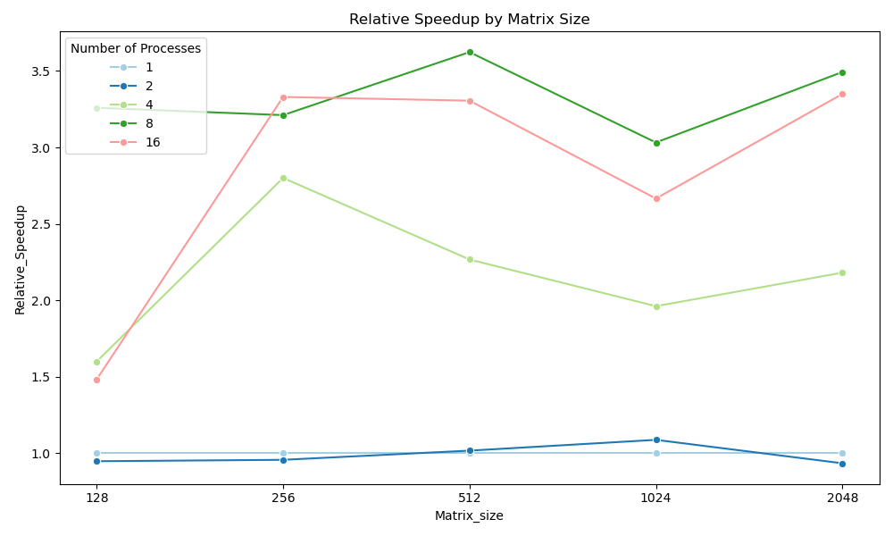
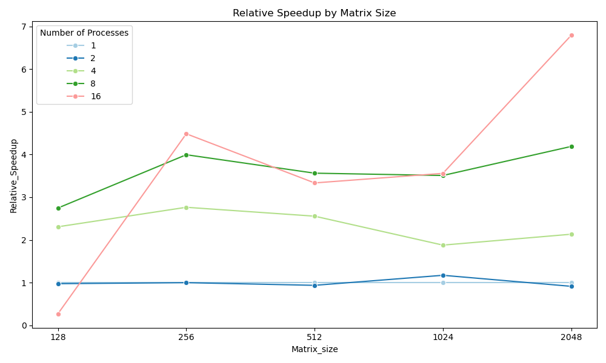

# 1-MPI矩阵乘法

## 实验目的

使用MPI点对点通信方式实现并行通用矩阵乘法(MPI-v1)，并通过实验分析不同进程数量、矩阵规模时该实现的性能。在实验中，讨论两个优化的方向

1. 在内存有限的情况下，如何进行大规模矩阵乘法计算
2. 如何提高大规模稀疏矩阵乘法性能

对于每一次计算，要求：

> **输入**：$m,\ n,\ k$三个整数，每个整数的取值范围均为$[128, 2048]$
>
> 随机生成$m\times n$的矩阵$A$及$n\times k$的矩阵$B$，并对这两个矩阵进行矩阵乘法运算，得到矩阵$C$
>
> **输出**：计算矩阵$C$所消耗的时间$t$

## 实验过程和核心代码

矩阵使用一维数组储存，三层嵌套循环计算乘法，这里略去了这些过程的代码

### 使用MPI点对点通信

代码位于`./src/mpiP2P.cpp`中

实现的核心函数为`MPI_Send`和`MPI_RECV`，它们的函数签名如下：

```C++
int MPI_Send(const void *buf, int count, MPI_Datatype datatype, 
             int dest, int tag, MPI_Comm comm)
    
int MPI_Recv(void *buf, int count, MPI_Datatype datatype, 
             int source, int tag, MPI_Comm comm, MPI_Status *status)
```

1个进程负责收发数据，其余进程负责计算并发回结果，实现如下

```C++
#include <mpi.h>
```

首先声明一些需要用到的参数

```C++
int n = atoi(argv[1]);     // 从主入口获取矩阵大小
int beginRow, endRow;      // 每个进程的计算范围
double beginTime, endTime; // 计时

int rank;       // 进程编号
int processNum; // 进程数量
```

初始化MPI

```C++
MPI_Init(NULL, NULL);
MPI_Comm_rank(MPI_COMM_WORLD, &rank);
MPI_Comm_size(MPI_COMM_WORLD, &processNum);

MPI_Status status;
```

对于进程数为1的情况，直接计算即可，下面讨论并行的情况

主进程需要将初始化的矩阵切割好并发送至各个进程

```C++
int rowsPerProcess = n / (processNum - 1); // 切割矩阵每块大小

if (rank == 0) // 进程0，主进程
{
    // 为其余进程发送切割好的数据
    // 若判断为最后一个进程，把剩下的全发过去
    for (int i = 0; i < processNum - 1; i++)
    {
        beginRow = rowsPerProcess * i;
        endRow = rowsPerProcess * (i + 1);
        if (i == processNum - 2)
            endRow = n;

        // 发送起始行，切割的A和全部的B
        MPI_Send(&beginRow, 1, MPI_INT, i + 1, 4, MPI_COMM_WORLD);
        MPI_Send(&matrixA[beginRow * n + 0], (endRow - beginRow) * n, 
                MPI_DOUBLE, i + 1, 0, MPI_COMM_WORLD);
        MPI_Send(&matrixB[0 * n + 0], n * n, 
                MPI_DOUBLE, i + 1, 1, MPI_COMM_WORLD);
    }

    // 接收其余进程计算好的部分的C并合并
    for (int i = 0; i < processNum - 1; i++)
    {
        beginRow = rowsPerProcess * i;
        endRow = rowsPerProcess * (i + 1);
        if (i == processNum - 2)
            endRow = n;

        MPI_Recv(&matrixC[beginRow * n + 0], (endRow - beginRow) * n, 
                MPI_DOUBLE, i + 1, 2, MPI_COMM_WORLD, &status);
    }
}
```

对于其余的进程，计算收到的A的切片与B相乘，再发回C的切片即可

```C++
if (rank != 0) // 其他进程
{   
    // 根据接收的起始行来初始化计算范围
    MPI_Recv(&beginRow, 1, MPI_INT, 0, 4, MPI_COMM_WORLD, &status);
    if (rank == processNum - 1)
        endRow = n;
    else
        endRow = rowsPerProcess * rank;

    // 接收A的切片和B
    MPI_Recv(&matrixA[0 * n + 0], (endRow - beginRow) * n, 
            MPI_DOUBLE, 0, 0, MPI_COMM_WORLD, &status);
    MPI_Recv(&matrixB[0 * n + 0], n * n, 
            MPI_DOUBLE, 0, 1, MPI_COMM_WORLD, &status);

    // 计算乘法
    matrixMultiply(matrixA, matrixB, matrixC, endRow - beginRow, n);

    // 将完成计算的切片的C发回
    MPI_Send(&matrixC[0 * 0 + 0], rowsPerProcess * n, 
            MPI_DOUBLE, 0, 2, MPI_COMM_WORLD);
}
```

这样就实现了使用基础点对点通讯的并行乘法，这种方法显然是存在优化空间的

### 优化方案：改用MPI集合通信

代码位于`./src/mpiGrpMsg`中

程序大致结构与优化前相同，区别在于将由`MPI_Send`和`MPI_Recv`实现的点对点通信改为由`MPI_Scatter` `MPI_Bcast`和`MPI_Gather`实现的集合通信。如下的代码块展示了它们的函数签名：

```c++
int MPI_Scatter(const void *sendbuf, int sendcount, MPI_Datatype sendtype, void *recvbuf, 
                int recvcount, MPI_Datatype recvtype, int root, MPI_Comm comm)
    
int MPI_Bcast(void *buffer, int count, MPI_Datatype datatype, int root, MPI_Comm comm)
   
int MPI_Gather(const void *sendbuf, int sendcount, MPI_Datatype sendtype, void *recvbuf, 
               int recvcount, MPI_Datatype recvtype, int root, MPI_Comm comm)    
```

更改的部分说明如下

在进程0中，使用`MPI_Scatter`将矩阵$A$切片并分发到各个进程的`localA`，使用`MPI_Bcast`将矩阵$B$广播

```c++
if (rank == 0)
{
    // ...
    MPI_Scatter(matrixA, rows * n, MPI_DOUBLE, 
                localA, rows * n, MPI_DOUBLE, 0, MPI_COMM_WORLD);
    MPI_Bcast(matrixB, n * n, MPI_DOUBLE, 0, MPI_COMM_WORLD);
}
```

由于`MPI_Scatter`的分发是平均的，意味着进程0也需要完成自己对应的矩阵乘法。并且若原矩阵大小无法被进程数整除，则需要进行补0操作再进行切片。由于实验数据恰好都可以整除，因此没有加入这一步骤

```c++
matrixMultiply(localA, matrixB, localC, rows, n);
```

完成计算后，使用`MPI_Gather`回收数据。这个函数可以在所有进程中使用，但是结果只会汇总到进程0的缓冲区

```c++
MPI_Gather(localC, rows * n, MPI_DOUBLE, matrixC, 
           rows * n, MPI_DOUBLE, 0, MPI_COMM_WORLD);
```

## 实验结果

运行平台：`Intel Core i7-11800H`，有8个核心并且支持超线程

编译和运行指令如下：

```shell
mpic++ ./src/mpiP2P.cpp -g -Wall -o ./bin/mpiP2P

for size in 128 256 512 1024 2048
do
    for np in 1 2 4 8 
    do
        mpirun  -np $np ./bin/mpiP2P $size | tee -a ./output/P2P.txt
    done
    mpirun --use-hwthread-cpus -np 16 ./bin/mpiP2P $size | tee -a ./output/P2P.txt
done
```

### 点对点通信

运行结果如下，第一行的数字代表了运行的线程数

| 矩阵规模 |   1    |   2    |   4    |   8    |   16   |
| :------: | :----: | :----: | :----: | :----: | :----: |
|   128    | 0.0051 | 0.0054 | 0.0032 | 0.0015 | 0.0034 |
|   256    | 0.0440 | 0.0460 | 0.0157 | 0.0137 | 0.0132 |
|   512    | 0.484  | 0.476  | 0.213  | 0.133  | 0.146  |
|   1024   |  4.30  |  3.95  |  2.19  |  1.41  |  1.61  |
|   2048   | 122.02 | 130.58 | 55.95  | 34.93  | 36.43  |

根据数据做出折线图：



### 集合通信

| 矩阵规模 |   1    |   2    |   4    |   8    |   16   |
| :------: | :----: | :----: | :----: | :----: | :----: |
|   128    | 0.0051 | 0.0053 | 0.0022 | 0.0018 | 0.0190 |
|   256    | 0.0436 | 0.0437 | 0.0157 | 0.0109 | 0.0097 |
|   512    | 0.479  | 0.512  | 0.187  | 0.134  | 0.143  |
|   1024   |  4.83  |  4.12  |  2.57  |  1.37  |  1.35  |
|   2048   | 120.75 | 132.58 | 56.61  | 28.83  | 17.78  |

作图如下：



### 结果分析

首先，虽然控制变量不太严格（处理器会变频）集合通信在大部分情况下确实提升了计算效率，单双线程在我们的P2P算法下都是实际一个线程在跑，速度差不多甚至更慢了也合理，在2，4，8线程上的计算效率对比体现了并行计算的优势，符合预期。

以下是一些不符合预期的点：

- 集合通信下单双线程效率也差不多
- 16线程的效率飘忽不定，可能与超线程和CPU核间通信效率有关

可能的解释如下

> 在一些情况下，超线程可以提高并行计算的性能。例如，如果一个应用程序有很多独立的线程，这些线程经常需要等待I/O操作（如磁盘读写或网络通信），那么超线程可以在一个线程等待时，让CPU切换到另一个线程，从而提高CPU的利用率。
>
> 然而，在其他情况下，超线程可能不会提高并行计算的性能，甚至可能降低性能。例如，如果一个应用程序的线程经常需要共享数据，那么超线程可能会增加缓存冲突和内存访问延迟。此外，如果一个应用程序已经充分利用了CPU的所有核心，那么超线程可能会导致线程之间的竞争，降低性能。

确实CPU在8进程的时候就已经跑满了，符合这个可能的原因；至于2线程的问题大概是因为通信效率

### 其他优化方向

> 在内存有限的情况下，如何进行大规模矩阵乘法计算？

1. 本次实验中已经使用的分块计算，当然还可以有更细致效率更高的同类方法
2. 使用磁盘临时储存
3. 使用迭代算法，避免一次性加载整个矩阵

> 如何提高大规模稀疏矩阵乘法性能？

1. 使用稀疏矩阵的储存方法，即只储存非零数的值核坐标
2. 重复使用相同数，减少访存次数
3. 采取并行计算

## 实验感想

在这次MPI矩阵乘法实验中，体验到了并行计算的强大之处。通过将大规模的矩阵乘法任务分解到多个进程上，显著地提高计算的效率。

然而，当继续增加进程数量时，计算时间有时并没有进一步减少，甚至有所增加。这说明并行计算并不总是能提高性能。当进程数量过多时，进程间的通信开销可能会超过并行计算带来的性能提升。并行计算算法应当考虑多方面因素，最终达到一个相对较好的效果。

