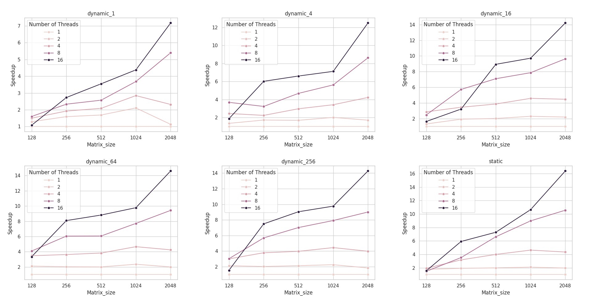
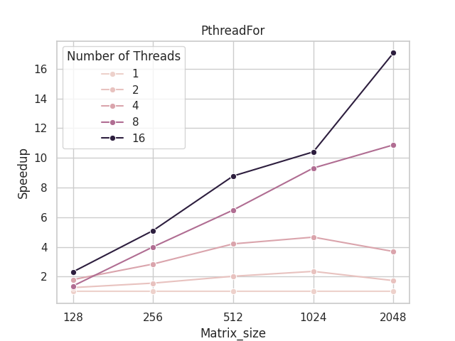

# 5-OpenMP矩阵乘法

## 实验目的

### OpenMP通用矩阵乘法

使用OpenMP多线程实现并行矩阵乘法，设置不同线程数量（1-16）、矩阵规模（128-2048）、**调度模式（默认、静态、动态调度）**，通过实验分析程序的并行性能。

### 构造基于Pthreads的并行for循环分解、分配、执行机制

模仿OpenMP的omp_parallel_for构造基于Pthreads的并行for循环分解、分配及执行机制。

生成一个包含parallel_for函数的动态链接库（.so）文件，该函数创建多个Pthreads线程，并行执行parallel_for函数的参数所指定的内容。

以下为parallel_for函数的基础定义

```C++
parallel_for(
    int start, int end, int inc, 
	void *(*functor)( int,void*), 
    void *arg, int num_threads)
```

- start, end, inc分别为循环的开始、结束及索引自增量；
- functor为函数指针，定义了每次循环所执行的内容；
- arg为functor的参数指针，给出了functor执行所需的数据；
- num_threads为期望产生的线程数量。
- 选做：除上述内容外，还可以考虑调度方式等额外参数。

## 实验过程和核心代码

### OpenMP通用矩阵乘法

代码位于`src/MatrixMultiply.cpp`

> OpenMP是一套C++并行编程框架，它是一个跨平台的多线程实现，能够使串行代码经过**最小的改动**自动转化成并行的。

OpenMP的使用方法为在程序中加入编译指导语句

```C++
#include <omp.h>

#pragma omp 指令 [子句[子句]…]
{
    //...
}
```

并且，编译时需要使用`-fopenmp`指令，例如

```bash
g++ src/MatrixMultiply.cpp -fopenmp -g -Wall -std=c++11 -o bin/MatrixMultiply
```

OpenMP 提供了几种调度策略来决定如何将迭代分配给线程。这些策略可以通过 `schedule` 子句在 `#pragma omp for` 或 `#pragma omp parallel for` 指令中指定。以下是 OpenMP 中的三种主要调度策略：

1. **静态调度（Static）**：在静态调度中，迭代在编译时就被分配给线程，每个线程得到大致相等数量的迭代。
2. **动态调度（Dynamic）**：在动态调度中，迭代在运行时被分配给线程。当一个线程完成它的迭代后，它会从未分配的迭代中获取更多的工作。
3. **默认调度（Default）**：如果没有指定 `schedule` 子句，那么就会使用默认调度策略。

在下面的程序中，考虑了静态调度和不同`chunk_size`的动态调度

- 对于静态调度（默认），使用语句

  ```C++
  #pragma omp parallel for num_threads(numThreads)
  ```

- 对于动态调度，使用语句

  ```C++
  #pragma omp parallel for num_threads(numThreads) collapse(2) schedule(dynamic, chunkSize)
  ```

  - 其中，`collapse` 是一个 OpenMP 指令，用于将多个嵌套的循环合并成一个更大的循环，以便更好地利用多线程。例如，有两个嵌套的循环，每个循环的迭代次数都是 10，那么使用 `collapse(2)` 后，这两个循环会被合并成一个有 100 次迭代的循环。
  - `chunkSize` 是另一个 OpenMP 调度策略的参数，用于指定每次分配给线程的迭代数量。例如，一个有 100迭代的循环，使用动态调度策略，并且设置 `chunksize` 为 10，那么每次会有 10 次迭代被分配给一个线程。

```C++
double** matrixMultiplyOpenMP(double** matrixA, double** matrixB, int rowA, int colA, int colB)
{
    double** matrixC = new double*[rowA];
    for (int i = 0; i < rowA; i++) {
        matrixC[i] = new double[colB];
    }
#if DYNAMIC // 用于调节模式的宏
#pragma omp parallel for num_threads(numThreads) collapse(2) schedule(dynamic, chunkSize)
    for (int i = 0; i < rowA; i++) {
        for (int j = 0; j < colB; j++) {
            matrixC[i][j] = 0;
            for (int k = 0; k < colA; k++) {
                matrixC[i][j] += matrixA[i][k] * matrixB[k][j];
            }
        }
    }
#else
#pragma omp parallel for num_threads(numThreads)
	// 执行过程与动态一样
    // ...
#endif
    return matrixC;
}
```

### 构造基于Pthreads的并行for循环分解、分配、执行机制

#### 代码部分

要达到类似OpenMP的效果，需要将一个`for`循环分配给不同的进程来执行，分配的过程可以使用Pthreads来实现。头文件位于`include/parallel.h`

```C++
#ifndef _PARALLEL_H
#define _PARALLEL_H

void parallel_for(
    int start, int end, int inc,
    void* (*functor)(int, void*),
    void* arg, int num_threads);

#endif
```

然后在`src/parallel.cpp`中定义该函数

首先，为了为线程函数传递参数，需要定义结构体

```C++
struct FunctorArgs {
    int index; // 线程编号
    void* arg; // 内层函数参数
    int start; // 循环开始下标
    int end; // 循环结束下标
    int inc; // 索引自增量
    void* (*functor)(int, void*); // 函数指针
};
```

对于静态调度，需要尽量平均的将任务分配给各个线程， 因此线程函数可以这样编写：每个线程在自己负责的循环内，将参数从外层传递进来，并使用函数指针调用`functor`函数

```C++
void* pthread_functor(void* arg)
{
    FunctorArgs* args = (FunctorArgs*)arg;
    int start = args->start;
    int end = args->end;

    for (int i = start; i < end; i += args->inc) {
        args->functor(i, args->arg);
    }
    delete args;
    return NULL;
}
```

在此基础上，可以编写`pthread_for`函数，在这个函数中，计算每个线程的工作量并创建和回收线程，实现`for`循环的多线程执行

```C++
void parallel_for(
    int start, int end, int inc,
    void* (*functor)(int, void*),
    void* arg, int num_threads)
{
    // 计算每个线程的工作量
    int work = (end - start) / inc;
    int work_per_thread = work / num_threads;
    // 创建线程
    pthread_t threads[num_threads];
    for (int i = 0; i < num_threads; i++) {
        // 计算每个线程的起始和结束索引
        int thread_start = start + i * work_per_thread * inc;
        int thread_end = thread_start + work_per_thread * inc;
        // 最后一个线程需要把剩下的全执行
        if (i == num_threads - 1)
            thread_end = end;

        // 创建线程
        FunctorArgs* args = new FunctorArgs;
        args->index = i;
        args->arg = arg;
        args->functor = functor;
        args->start = thread_start;
        args->end = thread_end;
        args->inc = inc;
        pthread_create(&threads[i], NULL, pthread_functor, args);
    }

    // 等待线程结束
    for (int i = 0; i < num_threads; i++) {
        pthread_join(threads[i], NULL);
    }
}
```

然后在程序中调用这个函数，代码位于`src/MM_PthreadFor.cpp`

```C++
#include "../include/parallel.h"


// Pthread线程函数，按行实现矩阵相乘
void* matrix_multiply(int i, void* arg)
{
    for (int j = 0; j < N; j++) {
        for (int k = 0; k < N; k++) {
            C[i][j] += A[i][k] * B[k][j];
        }
    }
    return NULL;
}

int main(int argn, char** argv)
{
    // 初始化矩阵
    //...
    
    parallel_for(0, N, 1, matrix_multiply, NULL, num_threads);

    // 释放资源
    // ...
}
```

#### 编译和使用

实验的文件目录如下

```
5_OpenMP/
├── assets
├── bin
├── build
├── include
├── output
└── src
```

对于`parallel.cpp`，使用如下编译指令

```bash
g++ src/parallel.cpp -g -Wall -std=c++11 -shared -fPIC -o build/libparallel.so
```

- `-shared`：这个选项告诉编译器生成一个共享库
- `-fPIC`：这个选项告诉编译器生成位置无关代码（Position Independent Code），这是生成共享库所需要的。

同时，要使源代码编译使可以正确链接到动态链接库，需要把库文件夹添加到环境变量

```bash
export LD_LIBRARY_PATH=path/to/your/lib:$LD_LIBRARY_PATH
```

或者在编译时指定使用的库，也是这里采取的方法

```bash
g++ src/MM_PthreadFor.cpp -g -Wall -std=c++11 -pthread -L build -l parallel -o bin/MM_PthreadFor
```

- `-L build`：这个选项告诉编译器在链接时搜索 `build` 目录下的库文件。
- `-l parallel`：这个选项告诉编译器链接名为 `parallel` 的库，编译器会在 `-L` 选项指定的目录中搜索这个库。

## 实验结果

### OpenMP

静态调度以及不同`chunksize`的动态调度在不同线程数下的加速比作图如下



### PthreadsFor

使用`Pthreads`实现的`for`循环分解在不同线程数下的加速比做图如下，调度策略为静态调度



### 结果分析

> 处理器：Intel Core Ultra7 155H
>
> 包含6个性能核，8个能效核以及2个低功耗高效内核

1. 随着矩阵规模的增大，新建线程的开销占比逐渐减小，并行的优势逐渐凸显；
2. 在OpenMP的动态调度中，当`ChunkSize`设置过小时，程序会频繁地为线程重新分配任务，在矩阵乘法场景下对性能的影响很大。`ChunkSize`为`1`和`4`时加速效果明显差于其他的调度方案；
3. 随着`ChunkSize`的增大，动态调度的结果逐渐向静态调度靠近，与理论的`ChunkSize`足够大的动态调度就是静态调度相符；
4. 使用`Pthreads`对`for`循环分解得到的结果与静态调度的结果基本一致，符合预期；
5. 一些情况下的加速比超出了理论的最大值，猜测与处理器各个核心的性能差距有关：单线程时调用的处理器核心为性能较差的核心。

## 实验感想

在实验过程中，我对于不同的调度策略以及线程数量进行了实验，观察到了不同参数对于并行计算性能的影响。特别是在动态调度中，`ChunkSize`的选择对于性能影响较大，需要根据具体的场景进行调优。同时，在编写基于`Pthreads`的`for`循环分解时，我了解了一些动态链接库相关的知识，知道了如何通过复用代码使程序本体更加精简。