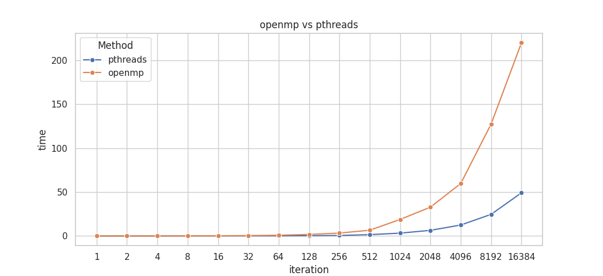

# 6-Pthreads并行构造

## 实验目的

### 构造基于Pthreads的并行for循环分解、分配、执行机制

模仿OpenMP的omp_parallel_for构造基于Pthreads的并行for循环分解、分配及执行机制。

生成一个包含parallel_for函数的动态链接库（.so）文件，该函数创建多个Pthreads线程，并行执行parallel_for函数的参数所指定的内容。

以下为parallel_for函数的基础定义

```C++
parallel_for(
    int start, int end, int inc, 
	void *(*functor)( int,void*), 
    void *arg, int num_threads)
```

- start, end, inc分别为循环的开始、结束及索引自增量；
- functor为函数指针，定义了每次循环所执行的内容；
- arg为functor的参数指针，给出了functor执行所需的数据；
- num_threads为期望产生的线程数量。
- 选做：除上述内容外，还可以考虑调度方式等额外参数。

### parallel_for并行应用

使用此前构造的parallel_for并行结构，将heated_plate_openmp改造为基于Pthreads的并行应用。

**heated plate**问题描述：规则网格上的热传导模拟，其具体过程为每次循环中通过对邻域内热量平均模拟热传导过程，即：
$$
w_{i,j}^{t+1}=\frac{1}{4}(w_{i-1,j-1}^t+w_{i-1,j+1}^t+w_{i+1,j-1}^t+w_{i+1,j+1}^t)
$$
其OpenMP实现见课程资料中的`heated_plate_openmp.c`

使用此前构造的parallel_for并行结构，将`heated_plate_openmp`实现改造为基于Pthreads的并行应用。测试不同线程、调度方式下的程序并行性能，并与原始`heated_plate_openmp.c`实现对比。

## 实验过程和核心代码

### 构造基于Pthreads的并行for循环分解、分配、执行机制

#### 代码部分

要达到类似OpenMP的效果，需要将一个`for`循环分配给不同的进程来执行，分配的过程可以使用Pthreads来实现。头文件位于`include/parallel.h`

```C++
#ifndef _PARALLEL_H
#define _PARALLEL_H

void parallel_for(
    int start, int end, int inc,
    void* (*functor)(int, void*),
    void* arg, int num_threads);

#endif
```

然后在`src/parallel.cpp`中定义该函数

首先，为了为线程函数传递参数，需要定义结构体

```C++
struct FunctorArgs {
    int index; // 线程编号
    void* arg; // 内层函数参数
    int start; // 循环开始下标
    int end; // 循环结束下标
    int inc; // 索引自增量
    void* (*functor)(int, void*); // 函数指针
};
```

对于静态调度，需要尽量平均的将任务分配给各个线程， 因此线程函数可以这样编写：每个线程在自己负责的循环内，将参数从外层传递进来，并使用函数指针调用`functor`函数

```C++
void* pthread_functor(void* arg)
{
    FunctorArgs* args = (FunctorArgs*)arg;
    int start = args->start;
    int end = args->end;
    long index = arg->index;

    for (int i = start; i < end; i += args->inc) {
        args->functor(i, &index);
    }
    delete args;
    return NULL;
}
```

在此基础上，可以编写`pthread_for`函数，在这个函数中，计算每个线程的工作量并创建和回收线程，实现`for`循环的多线程执行

```C++
void parallel_for(
    int start, int end, int inc,
    void* (*functor)(int, void*),
    void* arg, int num_threads)
{
    // 计算每个线程的工作量
    int work = (end - start) / inc;
    int work_per_thread = work / num_threads;
    // 创建线程
    pthread_t threads[num_threads];
    for (int i = 0; i < num_threads; i++) {
        // 计算每个线程的起始和结束索引
        int thread_start = start + i * work_per_thread * inc;
        int thread_end = thread_start + work_per_thread * inc;
        // 最后一个线程需要把剩下的全执行
        if (i == num_threads - 1)
            thread_end = end;

        // 创建线程
        FunctorArgs* args = new FunctorArgs;
        args->index = i;
        args->arg = arg;
        args->functor = functor;
        args->start = thread_start;
        args->end = thread_end;
        args->inc = inc;
        pthread_create(&threads[i], NULL, pthread_functor, args);
    }

    // 等待线程结束
    for (int i = 0; i < num_threads; i++) {
        pthread_join(threads[i], NULL);
    }
}
```

然后在程序中调用这个函数，代码位于`src/MM_PthreadFor.cpp`

```C++
#include "../include/parallel.h"


// Pthread线程函数，按行实现矩阵相乘
void* matrix_multiply(int i, void* arg)
{
    for (int j = 0; j < N; j++) {
        for (int k = 0; k < N; k++) {
            C[i][j] += A[i][k] * B[k][j];
        }
    }
    return NULL;
}

int main(int argn, char** argv)
{
    // 初始化矩阵
    //...
    
    parallel_for(0, N, 1, matrix_multiply, NULL, num_threads);

    // 释放资源
    // ...
}
```

#### 编译和使用

实验的文件目录如下

```
5_OpenMP/
├── assets
├── bin
├── build
├── include
├── output
└── src
```

对于`parallel.cpp`，使用如下编译指令

```bash
g++ src/parallel.cpp -g -Wall -std=c++11 -shared -fPIC -o build/libparallel.so
```

- `-shared`：这个选项告诉编译器生成一个共享库
- `-fPIC`：这个选项告诉编译器生成位置无关代码（Position Independent Code），这是生成共享库所需要的。

同时，要使源代码编译使可以正确链接到动态链接库，需要把库文件夹添加到环境变量

```bash
export LD_LIBRARY_PATH=path/to/your/lib:$LD_LIBRARY_PATH
```

或者在编译时指定使用的库，也是这里采取的方法

```bash
g++ src/MM_PthreadFor.cpp -g -Wall -std=c++11 -pthread -L build -l parallel -o bin/MM_PthreadFor
```

- `-L build`：这个选项告诉编译器在链接时搜索 `build` 目录下的库文件。
- `-l parallel`：这个选项告诉编译器链接名为 `parallel` 的库，编译器会在 `-L` 选项指定的目录中搜索这个库。

### parallel_for并行应用

代码位于`src/heated_plate_pthreads.cpp`

原程序的大致步骤为

1. 初始化解的内部值为边界值的平均值。
2. 进行迭代。在每次迭代中，首先将旧的解保存在数组u中，然后计算新的解。新的解是每个格点的北、南、东、西四个邻居的平均值。
3. 计算新的解和旧的解之间的最大差异。如果这个差异小于误差阈值，那么停止迭代。否则，继续迭代。

根据原程序以及编写的Parallel_for函数的特点，为原程序中需要并行执行的for循环编写函数以传递给pthreads线程来执行，主要编写了的函数如下

```C++
// 初始化矩阵的边界
void* init_i(int i, void* arg);
void* init_j(int j, void* arg);

// 计算平均值，用于初始化矩阵
void* calculate_mean_i(int i, void* arg);
void* calculate_mean_j(int j, void* arg);

// 使用计算好的平均值初始化矩阵
void* init_interior(int i, void* arg);

// 拷贝矩阵，用于比较两次迭代间的结果
void* copy_w_to_u(int i, void* arg);

// 计算迭代
void* generate_w(int i, void* arg);

// 计算迭代最大差异
void* calculate_diff(int i, void* arg);
```

其中，一些并行部分在原程序中使用了OpenMP提供的规约计算和共享变量，由于pthreads并不方便这么做，因此在这里实现的做法为维护一个大小为线程数的数组，将每个线程的计算结果暂于数组中，并在串行部分进行规约。例如`calculate_diff`函数：

```c++
double my_diff[MAX_THREADS] = { 0 };

void* calculate_diff(int i, void* arg)
{
    long thread_num = *((long*)arg);
    for (int j = 1; j < N - 1; j++) {
        if (my_diff[thread_num] < fabs(w[i][j] - u[i][j])) {
            my_diff[thread_num] = fabs(w[i][j] - u[i][j]);
        }
    }
    return NULL;
}

int main(){
    //...
    parallel_for(1, M - 1, 1, calculate_diff, NULL, MAX_THREADS);
    for (int i = 0; i < MAX_THREADS; i++) {
        if (diff < my_diff[i]) {
            diff = my_diff[i];
        }
    }
}
```

以及`calculate_mean`函数：

```C++
double my_mean[MAX_THREADS] = { 0 };

void* calculate_mean_i(int i, void* arg)
{
    // 获取pthread的线程号
    long thread_num = *((long*)arg);
    my_mean[thread_num] += w[i][0] + w[i][N - 1];
    
    return NULL;
}

void* calculate_mean_j(int j, void* arg)
{
    // 获取pthread的线程号
    long thread_num = *((long*)arg);
    my_mean[thread_num] += w[M - 1][j] + w[0][j];

    return NULL;
}

int main(){
    //...
    parallel_for(1, M - 1, 1, calculate_mean_i, NULL, MAX_THREADS);
    parallel_for(0, N, 1, calculate_mean_j, NULL, MAX_THREADS);

    // 规约并计算平均值
    for (int i = 0; i < MAX_THREADS; i++) {
        mean += my_mean[i];
    }
    //...
}
```

其余的并行函数编写更为简单，就不在报告中一一列举了

## 实验结果

### 构造基于Pthreads的并行for循环分解、分配、执行机制


在矩阵乘法上的性能与之前的并行方法相当

### parallel_for并行应用

原程序运行结果：

使用pthreads改写的程序运行结果：


可以看到，除了运行时间外的输出结果是一样的，证明了程序的正确性

根据每一次输出时的运行时间作图如下：



可以看出在复杂场景的应用下，pthreads的性能大幅领先于OpenMP，符合两者各自的特点

- pthreads提供了更低级别的线程控制，允许程序员手动创建、同步和管理线程。这意味着使用pthreads可以实现更精细的并行控制，但编程复杂性也更高。

- OpenMP是一个更高级别的并行编程模型，它通过编译器指令自动处理线程的创建、销毁和同步。这使得OpenMP在编程复杂性上比pthreads要简单很多，但可能在某些情况下牺牲了一些性能。

## 实验总结

在这次实验中，我对于Pthreads的编程方法有了更好的了解，实践了如何通过动态链接库编写相对复杂的并行，也在程序的改写过程中体会了OpenMP编程的优势所在，即相比Pthreads在程序复杂性上简单很多。

在实验结果的分析中，我看到了通过更为精细的控制和更复杂的代码编写，Pthreads在相同任务上可以实现比OpenMP相对高效许多的性能。